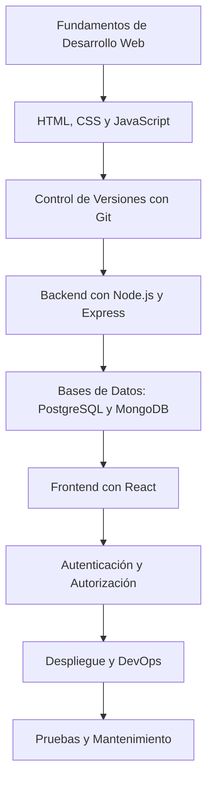

Matías Vejar Reyes

Ingeniero en Bioinformática con Minor en Genómica | Aspirante a Desarrollador Full Stack

  

---

Sobre Mí

Soy un ingeniero en bioinformática con un minor en genómica, actualmente enfocándome en expandir mis habilidades hacia el desarrollo full stack. Durante mi formación académica, adquirí conocimientos básicos en desarrollo web, incluyendo HTML, CSS, JavaScript, PHP, PostgreSQL y Bootstrap. Ahora, estoy comprometido en profundizar en estas áreas para convertirme en un desarrollador full stack competente.

Habilidades Técnicas

- Lenguajes de Programación:

- Python (Intermedio)

- R (Intermedio)

- Bash (Intermedio)

- C, C++, Java (Básico)

Tecnologías y Herramientas:

- Conda

- Firebase (Recientemente iniciado)

- PostgreSQL

- MySQL

Objetivos de Aprendizaje

Mis metas a corto plazo incluyen:

- Dominar Node.js para el desarrollo del lado del servidor.

- Aprender React para construir interfaces de usuario dinámicas.

- Profundizar en Firebase para gestión de bases de datos y autenticación.

- Familiarizarme con bases de datos modernas y no relacionales.

Roadmap de Desarrollo Full Stack

A continuación, presento un plan de estudio estructurado para guiar mi progreso en el desarrollo full stack:

Nota: Este roadmap es una guía flexible y se adaptará según avance en mi aprendizaje.

Proyecto Actual

Portafolio Personal: Actualmente, estoy desarrollando mi portafolio para mostrar mis proyectos y habilidades. Puedes verlo en mi repositorio de GitHub.

Contribuciones y Colaboraciones

Aunque no he participado en proyectos colaborativos hasta la fecha, estoy entusiasmado por unirme a iniciativas de código abierto y trabajar en equipo para enriquecer mi experiencia y aportar al desarrollo comunitario.

Contacto

Correo Electrónico: matiasvejarr@gmail.com

LinkedIn: [Matias Véjar](https://www.linkedin.com/in/matias-véjar-reyes-765b49162)

Portafolio: [matiasvejarr.github.io/portfolio](https://matiasvejarr.github.io/portfolio)
